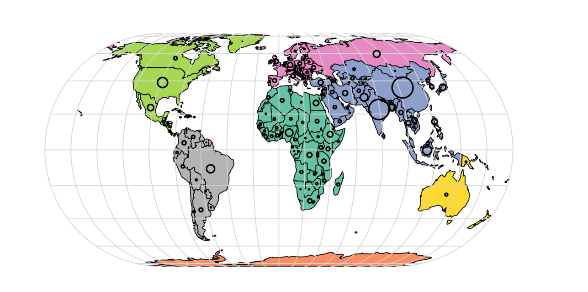

  <section class="welcome-text">
    <h2 id="welcome">Welcome</h2>
    
This website hosts my coursework for <strong>ISSS626 – Geospatial Analytics and Applications</strong>.

    <ul>
      <li>📝 Hands-on Exercises</li>
      <li>🧾 Take-home Exercises (coming soon)</li>
    </ul>
  </section>

  <figure class="welcome-fig">
    
  </figure>

## Contacts
- **Email:** [gautamgovan@gmail.com](mailto:gautamgovan@gmail.com)
- **LinkedIn:** <https://www.linkedin.com/in/gautamgovan-e>

